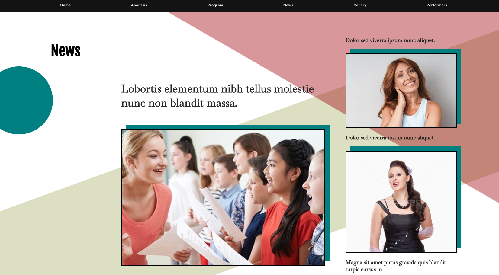
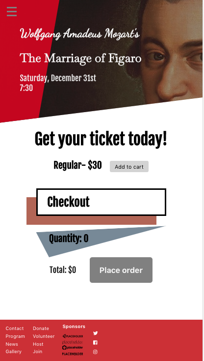
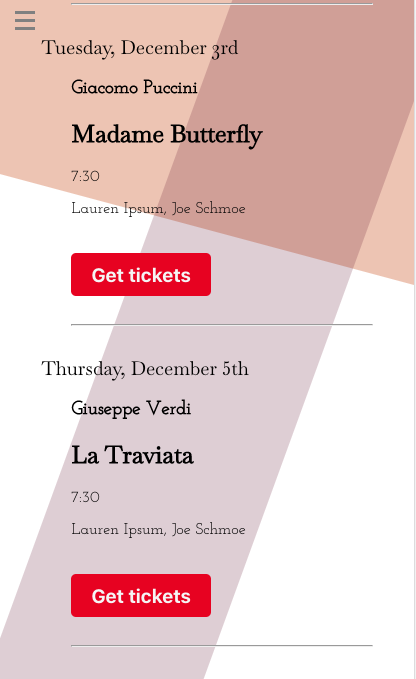
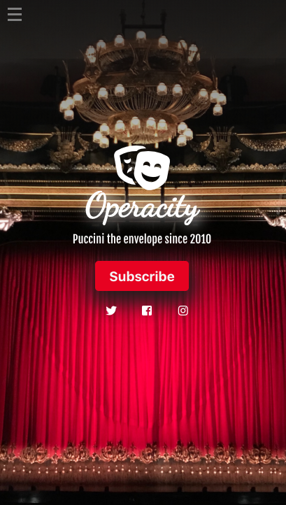

# Operacity

## Table of Content
* [General Info](#general-info)
* [Technologies](#technologies)
* [Setup](#setup)
* [Features](#features)
* [Screenshots](#screenshots)

### General Info
Operacity is the name of a non-existing amateur opera company that I built this website for. It takes into what you would expect a website for such an enterprise to contain. News, a program, a simple ticket purchase engine, image gallery and information about the company and its performers. It is mobile friendly and shows an attempt at a design-conscious approach.
It employs React hooks and router, and although there is a newsletter signup form, there is no backend hookup.
## [Live app](https://operacity.benjcohen1985.now.sh/)

### Technologies
Project is created with:
* React
* CSS3

### Setup
Clone this repo to your desktop and run `npm install` to install all the dependencies. When you're done, type `npm start`.

### Features 
* Mobile friendly
* Dummy newsletter signup 
* Dummy ticket purchase engine
* Responsive layout

### Screenshots

